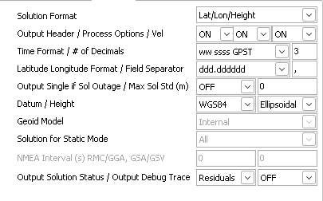

Tools to calculate DJI Phantom 4 RTK (PH4RTK) PPK positions.

# rinex_to_ppk
* Extract PPK positions using Rinex file from RTKPOST and Timestamp.MRK from PH4RTK to csv file.
* PPK positions should be in csv format with ',' as delimiter



[OpenDroneMap](https://opendronemap.org/) option to have EPSG:4326 in the output file

- Usage examples
 :
```python3 rinex_to_ppk.py -r 100_0138_Rinex.pos -t 100_0138_Timestamp.MRK --odm -o ./ ```


